Class 5: R Graphics
================
Brie Diaz
Fri Apr 19 13:25:51 2019

``` r
# Class 5 R graphics and plots


# get the data in
weight <- read.table("bimm143_05_rstats/weight_chart.txt", header = TRUE)

# 2A. plot a scatterplot of age vs weight
plot(weight$Age, weight$Weight)
```

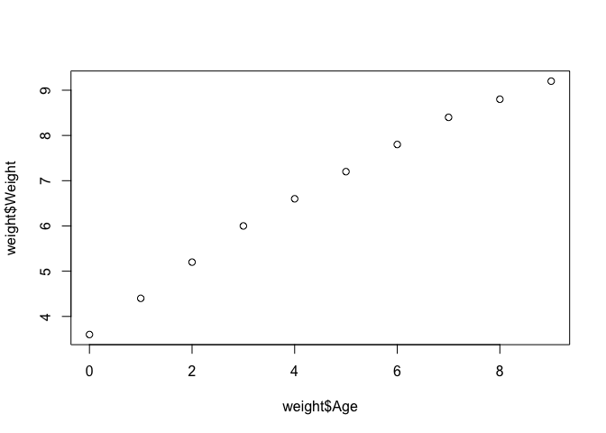

``` r
# use plot() function to draw as a point line graph with special details
plot(weight$Age, weight$Weight, type="o", xlab="Age (months)", ylab="Weight (kg)",
     pch = 15, cex=1.5, lwd=2, ylim=c(2,10), main="Infant Growth")
```

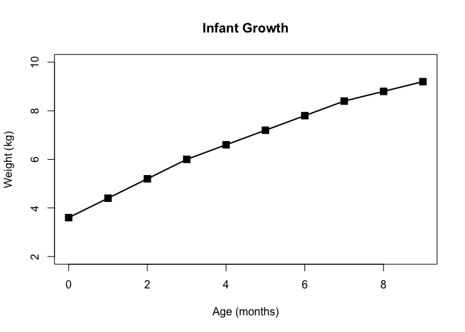

``` r
# 2B. Barplot
feat <- read.table("bimm143_05_rstats/feature_counts.txt", header=TRUE, sep="\t")

# OR you can also use 
feat <- read.delim("bimm143_05_rstats/feature_counts.txt")

# create bar plot
barplot(feat$Count, horiz=TRUE, names.arg = feat$Feature,
        main="Number of features in the mouse GRCm38 genome", las=1)
```

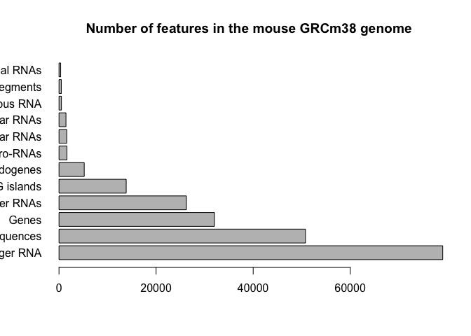

``` r
old.par <- par()$mar

# labels are clipped off - time to fix them
par(mar=c(3.1,11.1,4.1,2))
barplot(feat$Count, horiz=TRUE, names.arg=feat$Feature,
        main="Number of features in the mouse GRCm38 genome", las=1, col.main= "blue") 
```

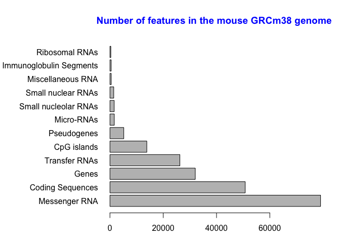

``` r
# still want to edit the title for this graph

# section 3A 
mf <- read.delim("bimm143_05_rstats/male_female_counts.txt", header=TRUE)

par(mar=c(5,7,4,4))
barplot(mf$Count, col=c("blue", "salmon1"), names.arg=mf$Sample, ylab="Counts", las=2)
```

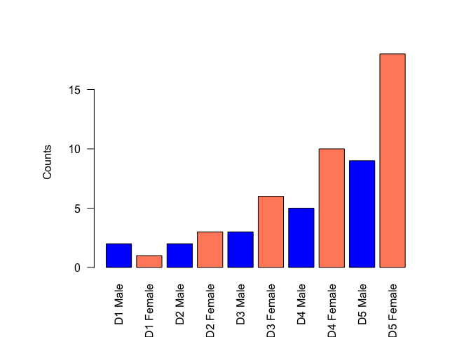

``` r
# Section 3B
genes <- read.delim("bimm143_05_rstats/up_down_expression.txt")
nrow(genes)
```

    ## [1] 5196

``` r
table(genes$State)
```

    ## 
    ##       down unchanging         up 
    ##         72       4997        127

``` r
plot(genes$Condition1, genes$Condition2, ylab = "Expression Condition 2", xlab = "Expression Condition 1", col=genes$State)
```

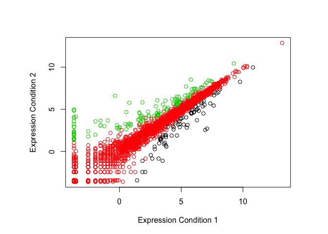

``` r
palette(c("red", "green", "blue"))
plot(genes$Condition1, genes$Condition2, ylab = "Expression Condition 2", xlab = "Expression Condition 1", col=genes$State)
```

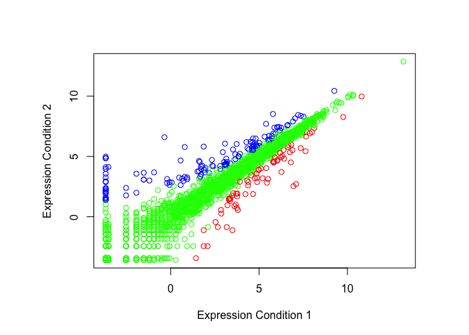

``` r
# 3C. Dynamic use of color 
meth <- read.delim("bimm143_05_rstats/expression_methylation.txt", header=TRUE)

#scatterplot
plot(meth$gene.meth, meth$expression, xlab = "Gene", ylab = "Expression")
```

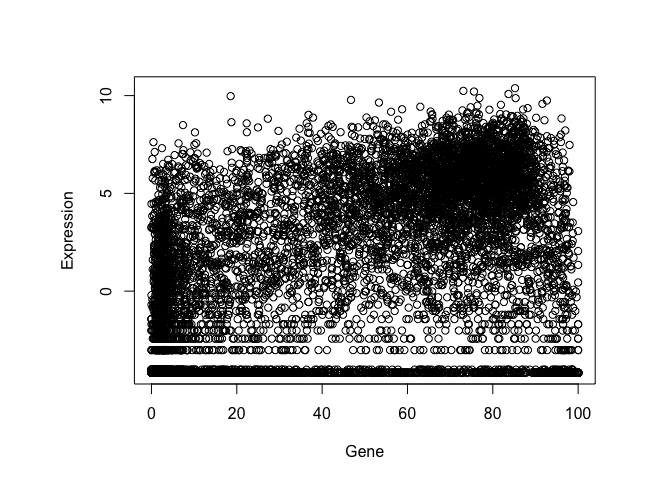

``` r
dcols <- densCols(meth$gene.meth, meth$expression)

# Plot changing the plot character ('pch') to a solid circle
plot(meth$gene.meth, meth$expression, col = dcols, pch =20, xlab = "Gene", ylab = "Expression")
```

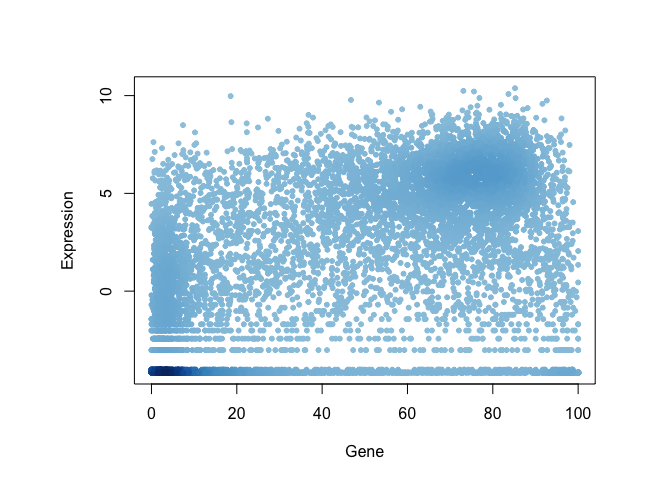

``` r
# only plot genes that have more than zero expression values
# Find the indices of genes with above 0 expression
inds <- meth$expression > 0 

# Plot just these genes
plot(meth$gene.meth[inds], meth$expression[inds], col = dcols, pch =20, xlab = "Gene", ylab = "Expression")
```

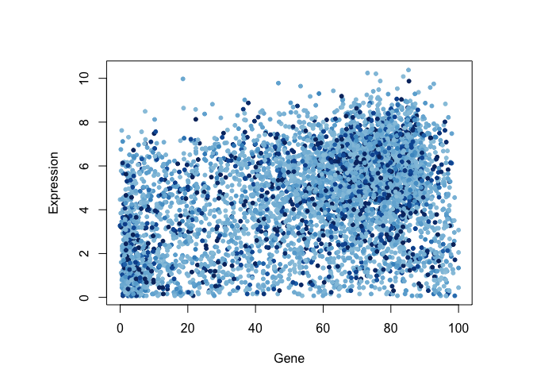

``` r
dcols.custom <- densCols(meth$gene.meth[inds], meth$expression[inds],
                         colramp = colorRampPalette(c("blue2",
                                                      "green2",
                                                      "red2",
                                                      "yellow")))
plot(meth$gene.meth[inds], meth$expression[inds], 
     col = dcols.custom, pch = 20, xlab = "Gene", ylab = "Expression")
```

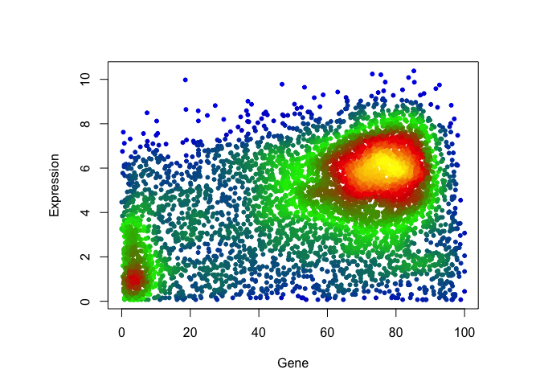
