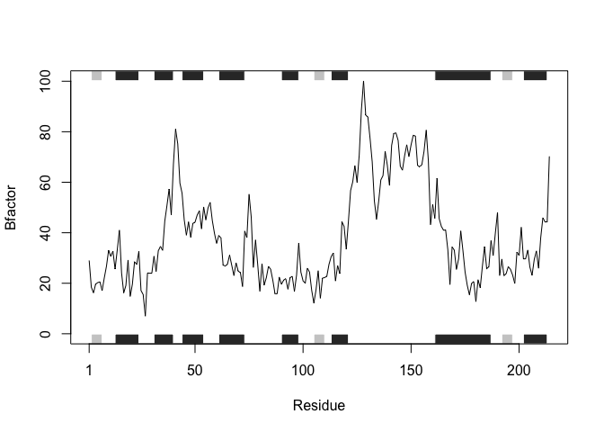

Section\_1B\_worksheet
================
Brie Diaz
4/19/2019

``` r
#install.packages("bio3d")
```

Improve the analysis code
-------------------------

``` r
library(bio3d)
s1 <- read.pdb("4AKE") # kinase with drug
```

    ##   Note: Accessing on-line PDB file

``` r
s2 <- read.pdb("1AKE") # kinase no drug
```

    ##   Note: Accessing on-line PDB file
    ##    PDB has ALT records, taking A only, rm.alt=TRUE

``` r
s3 <- read.pdb("1E4Y") # kinase with drug
```

    ##   Note: Accessing on-line PDB file

``` r
s1.chainA <- trim.pdb(s1, chain="A", elety="CA")
s2.chainA <- trim.pdb(s2, chain="A", elety="CA")
s3.chainA <- trim.pdb(s3, chain="A", elety="CA")
s1.b <- s1.chainA$atom$b
s2.b <- s2.chainA$atom$b
s3.b <- s3.chainA$atom$b
plotb3(s1.b, sse=s1.chainA, typ="l", ylab="Bfactor")
```


``` r
plotb3(s2.b, sse=s2.chainA, typ="l", ylab="Bfactor")
```


``` r
plotb3(s3.b, sse=s3.chainA, typ="l", ylab="Bfactor")
```


Q1 What type of object is returned from the read.pdb() function?
----------------------------------------------------------------

``` r
is.list(s1)
```

    ## [1] TRUE

-   the read.pdb() function reads a PDB file and returns a list

Q2 What does the trim.pbd() function do?
----------------------------------------

``` r
?trim.pdb
```

-   Trims a PBD object to a subset of atoms; description: produces a new smaller PDB object, containing a subset of atoms, from a given larger PDB object

Q3 What input parameter would turn off the marginal black and gray rectangles in the plots and what do they represent in this case?
-----------------------------------------------------------------------------------------------------------------------------------

-   remove sse or set to FALSE; also, you could set both top = FALSE and bot = FALSE

``` r
?plot.bio3d
```

plotb3 draws a standard scatter plot with optional secondary structure in the marginal regions

Q5 Which proteins are more similar to each other in their B-factor trends
-------------------------------------------------------------------------

``` r
hc <- hclust(dist(rbind(s1.b, s2.b, s3.b)))
plot(hc)
```


-   Proteins 1AKE and 1E4Y (represented by s2.b and s3.b, respectively) are more similar to each other

Q6 How would you generalize the original code above to work with any set of input protein structures?
-----------------------------------------------------------------------------------------------------

### Don't ever start like this: copy and paste each line of function

makeplot &lt;- function(x) { s1 &lt;- read.pdb(x) \# kinase with drug s1.chainA &lt;- trim.pdb(s1, chain="A", elety="CA") s1.b &lt;- s1.chainA*a**t**o**m*b plotb3(s1.b, sse=s1.chainA, typ="l", ylab="Bfactor") }

### instead, make small working snippets of code

First, access the proteins sequence from PDP and save as "pseq"

``` r
x <- "4AKE"
pseq <- read.pdb(x)
```

    ##   Note: Accessing on-line PDB file

    ## Warning in get.pdb(file, path = tempdir(), verbose = FALSE): /var/folders/
    ## 2l/s152rlf121v7z6zp2br1y6bw0000gn/T//RtmpfySorm/4AKE.pdb exists. Skipping
    ## download

``` r
pseq
```

    ## 
    ##  Call:  read.pdb(file = x)
    ## 
    ##    Total Models#: 1
    ##      Total Atoms#: 3459,  XYZs#: 10377  Chains#: 2  (values: A B)
    ## 
    ##      Protein Atoms#: 3312  (residues/Calpha atoms#: 428)
    ##      Nucleic acid Atoms#: 0  (residues/phosphate atoms#: 0)
    ## 
    ##      Non-protein/nucleic Atoms#: 147  (residues: 147)
    ##      Non-protein/nucleic resid values: [ HOH (147) ]
    ## 
    ##    Protein sequence:
    ##       MRIILLGAPGAGKGTQAQFIMEKYGIPQISTGDMLRAAVKSGSELGKQAKDIMDAGKLVT
    ##       DELVIALVKERIAQEDCRNGFLLDGFPRTIPQADAMKEAGINVDYVLEFDVPDELIVDRI
    ##       VGRRVHAPSGRVYHVKFNPPKVEGKDDVTGEELTTRKDDQEETVRKRLVEYHQMTAPLIG
    ##       YYSKEAEAGNTKYAKVDGTKPVAEVRADLEKILGMRIILLGAPGA...<cut>...KILG
    ## 
    ## + attr: atom, xyz, seqres, helix, sheet,
    ##         calpha, remark, call

Next, trim protein sequence so that it includes only chain A of the protein.

``` r
pseq.chainA <- trim.pdb(pseq, chain="A", elety="CA")
pseq.chainA
```

    ## 
    ##  Call:  trim.pdb(pdb = pseq, chain = "A", elety = "CA")
    ## 
    ##    Total Models#: 1
    ##      Total Atoms#: 214,  XYZs#: 642  Chains#: 1  (values: A)
    ## 
    ##      Protein Atoms#: 214  (residues/Calpha atoms#: 214)
    ##      Nucleic acid Atoms#: 0  (residues/phosphate atoms#: 0)
    ## 
    ##      Non-protein/nucleic Atoms#: 0  (residues: 0)
    ##      Non-protein/nucleic resid values: [ none ]
    ## 
    ##    Protein sequence:
    ##       MRIILLGAPGAGKGTQAQFIMEKYGIPQISTGDMLRAAVKSGSELGKQAKDIMDAGKLVT
    ##       DELVIALVKERIAQEDCRNGFLLDGFPRTIPQADAMKEAGINVDYVLEFDVPDELIVDRI
    ##       VGRRVHAPSGRVYHVKFNPPKVEGKDDVTGEELTTRKDDQEETVRKRLVEYHQMTAPLIG
    ##       YYSKEAEAGNTKYAKVDGTKPVAEVRADLEKILG
    ## 
    ## + attr: atom, helix, sheet, seqres, xyz,
    ##         calpha, call

Next, access the Temperature factor, represented by the "b" vector within the "atom" data frame for this trimmed sequence

``` r
pseq.chainA <- trim.pdb(pseq, chain="A", elety="CA")
pseq.b <- pseq.chainA$atom$b
```

Make a line plot of the Temperature Factor data with the y-axis labeled "Bfactor"

``` r
pseq.chainA <- trim.pdb(pseq, chain="A", elety="CA")
pseq.b <- pseq.chainA$atom$b
plotb3(pseq.b, sse=pseq.chainA, type = "l", ylab="Bfactor")
```


Finally, turn overall working snippets into a function!

-   The input(x) is a name of a protein sequence in PDB; simply set x = "*name\_of\_PDB\_seq*" in the function itself

-   the function will:

1.  read the PDF sequence you assign to it
2.  trim your protein sequence to include chain A alpha carbons; creates a new PDB object based on a selection of atoms
3.  access the B factor (Temperature Factor) for all atoms in the trimmed protein sequence
4.  produce a line plot of Residue vs. B Factor --&gt; this is the overall output of the function!

``` r
makeplot <- function(x) {
  pseq <- read.pdb(x)
  pseq.chainA <- trim.pdb(pseq, chain="A", elety="CA")
  pseq.b <- pseq.chainA$atom$b
  plotb3(pseq.b, sse=pseq.chainA, type = "l", ylab="Bfactor")
}
```

Test out new function:

``` r
makeplot("4AKE")
```

    ##   Note: Accessing on-line PDB file

    ## Warning in get.pdb(file, path = tempdir(), verbose = FALSE): /var/folders/
    ## 2l/s152rlf121v7z6zp2br1y6bw0000gn/T//RtmpfySorm/4AKE.pdb exists. Skipping
    ## download



``` r
makeplot("1AKE")
```

    ##   Note: Accessing on-line PDB file

    ## Warning in get.pdb(file, path = tempdir(), verbose = FALSE): /var/folders/
    ## 2l/s152rlf121v7z6zp2br1y6bw0000gn/T//RtmpfySorm/1AKE.pdb exists. Skipping
    ## download

    ##    PDB has ALT records, taking A only, rm.alt=TRUE


``` r
makeplot("1E4Y")
```

    ##   Note: Accessing on-line PDB file

    ## Warning in get.pdb(file, path = tempdir(), verbose = FALSE): /var/folders/
    ## 2l/s152rlf121v7z6zp2br1y6bw0000gn/T//RtmpfySorm/1E4Y.pdb exists. Skipping
    ## download


