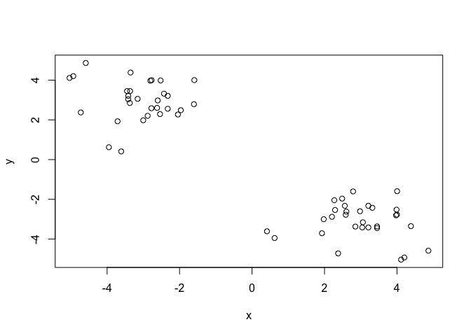
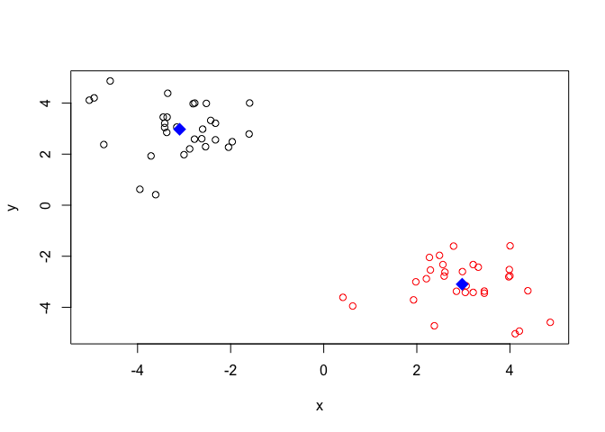
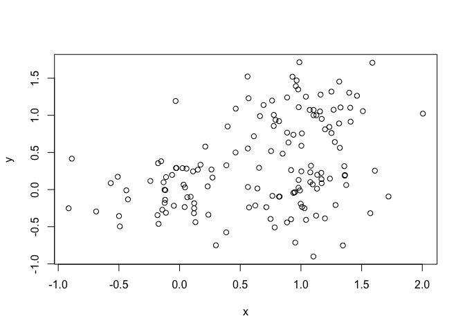
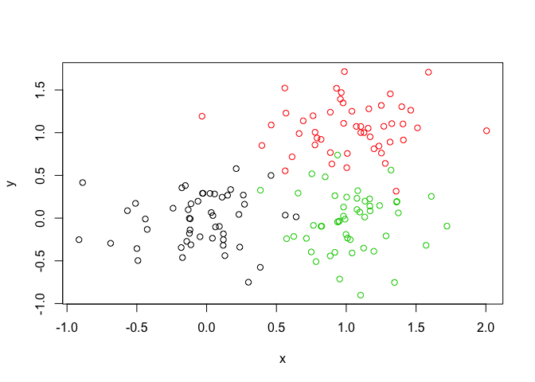
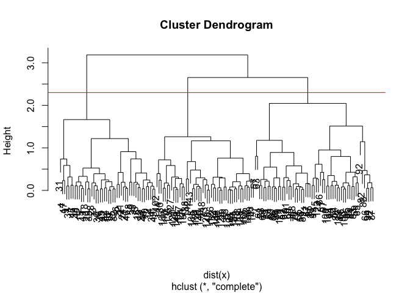
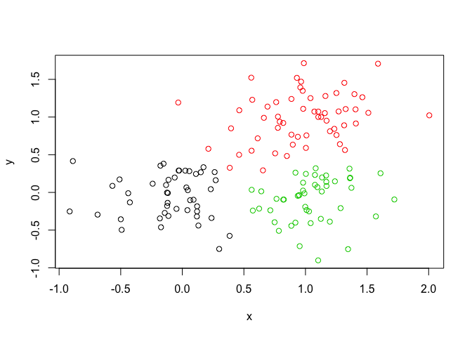
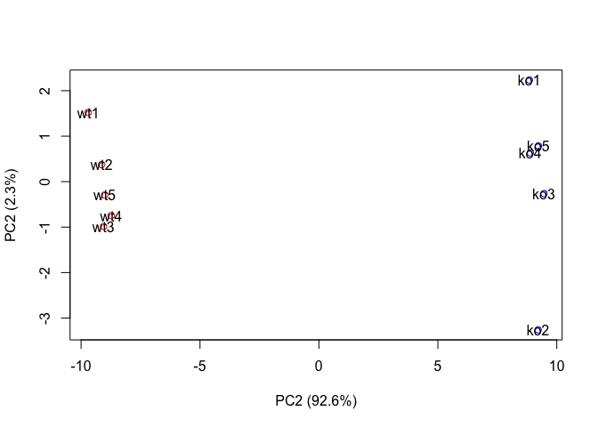
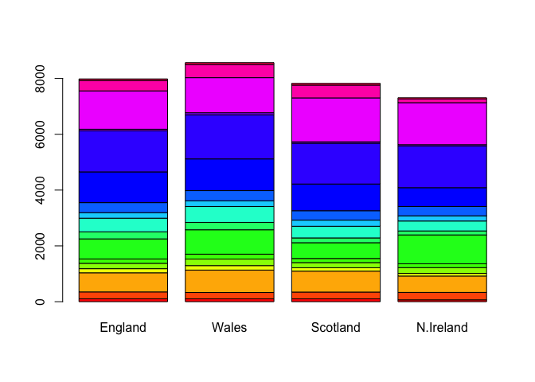
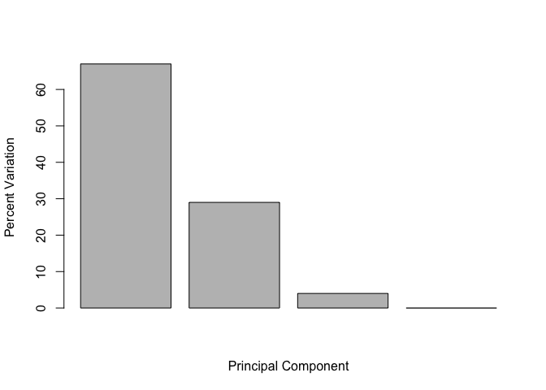

Class 8: Machine Learning
================
Brie Diaz
4/26/2019

Let's try ot the **kmens()** fnction in R with some made up data

``` r
tmp <- c(rnorm(30,-3), rnorm(30,3))
x <- cbind(x=tmp, y=rev(tmp))
plot(x)
```



Use the kmeans() function setting k to 2 and nstart=20

``` r
km <- kmeans(x, centers =2, nstart=20)
```

Inspect/print the results Q. How many points are in each cluster?

``` r
km$size
```

    ## [1] 30 30

-   30

Q. What ‘component’ of your result object details - cluster size? --&gt; the "size" component gives the nmber of points within each cluster

``` r
km$size
```

    ## [1] 30 30

         - cluster assignment/membership? --> the "cluster" vector indicates the cluster to which each point is allocated 

``` r
km$cluster
```

    ##  [1] 1 1 1 1 1 1 1 1 1 1 1 1 1 1 1 1 1 1 1 1 1 1 1 1 1 1 1 1 1 1 2 2 2 2 2
    ## [36] 2 2 2 2 2 2 2 2 2 2 2 2 2 2 2 2 2 2 2 2 2 2 2 2 2

         - cluster center? --> the "centers" component gives a matrix of cluster centers

``` r
km$centers
```

    ##           x         y
    ## 1 -2.936373  2.777527
    ## 2  2.777527 -2.936373

Plot x colored by the kmeans cluster assignment and add cluster centers as blue points

``` r
plot(x, col=km$cluster)
points(km$centers, col="blue", pch=18, cex=2)
```



\#\# Hierarchical Clustering

Here we don't have to spell out K the number of clusters beforehand but we do have to give it a distance matrix as input

``` r
d <- dist(x)
hc <- hclust(d)
hc
```

    ## 
    ## Call:
    ## hclust(d = d)
    ## 
    ## Cluster method   : complete 
    ## Distance         : euclidean 
    ## Number of objects: 60

Let's plot the results

``` r
plot(hc)
abline(h=6, col="red")
abline(h=4, col="blue")
```


``` r
cutree(hc, h=6)
```

    ##  [1] 1 1 1 1 1 1 1 1 1 1 1 1 1 1 1 1 1 1 1 1 1 1 1 1 1 1 1 1 1 1 2 2 2 2 2
    ## [36] 2 2 2 2 2 2 2 2 2 2 2 2 2 2 2 2 2 2 2 2 2 2 2 2 2

``` r
gp2 <- cutree(hc, k=2)
gp2
```

    ##  [1] 1 1 1 1 1 1 1 1 1 1 1 1 1 1 1 1 1 1 1 1 1 1 1 1 1 1 1 1 1 1 2 2 2 2 2
    ## [36] 2 2 2 2 2 2 2 2 2 2 2 2 2 2 2 2 2 2 2 2 2 2 2 2 2

``` r
gp3 <- cutree(hc, k=3)
gp3
```

    ##  [1] 1 1 1 1 1 1 1 1 1 1 1 1 1 1 1 1 1 1 1 1 1 1 1 1 1 1 1 1 1 1 2 3 2 2 3
    ## [36] 3 2 3 2 2 2 3 2 2 2 2 3 2 2 3 2 2 2 2 3 2 2 2 2 2

``` r
table(gp2)
```

    ## gp2
    ##  1  2 
    ## 30 30

``` r
table(gp3)
```

    ## gp3
    ##  1  2  3 
    ## 30 22  8

``` r
table(gp2, gp3)
```

    ##    gp3
    ## gp2  1  2  3
    ##   1 30  0  0
    ##   2  0 22  8

Step 1. Generate some example data for clustering
=================================================

``` r
x <- rbind(
 matrix(rnorm(100, mean=0, sd = 0.3), ncol = 2), # c1
 matrix(rnorm(100, mean = 1, sd = 0.3), ncol = 2), # c2
 matrix(c(rnorm(50, mean = 1, sd = 0.3), # c3
 rnorm(50, mean = 0, sd = 0.3)), ncol = 2))
colnames(x) <- c("x", "y")
```

Step 2. Plot the data without clustering
========================================

``` r
plot(x)
```



Step 3. Generate colors for known clusters
==========================================

(just so we can compare to hclust results)
==========================================

``` r
col <- as.factor( rep(c("c1","c2","c3"), each=50) )
plot(x, col=col)
```



Q. Use the dist(), hclust(), plot() and cutree() functions to return 2 and 3 clusters

``` r
hc <- hclust(dist(x))
```

``` r
plot(hc)
abline(h=2.3, col="red")
```



Q. How does this compare to your known 'col' groups?

``` r
gp2 <- cutree(hc, k=2)
gp3 <- cutree(hc, k=3)


table(gp2)
```

    ## gp2
    ##   1   2 
    ##  49 101

``` r
table(gp3)
```

    ## gp3
    ##  1  2  3 
    ## 49 47 54

``` r
plot(x, col=gp3)
```



\#\# Principal Component Analysis (PCA)

We will use the base R **prcomp()** function for PCA today...

let's get some RNAseq data to play with

``` r
mydata <- read.csv("expression.csv", row.names=1)
mydata
```

    ##          wt1 wt2  wt3  wt4  wt5 ko1  ko2  ko3  ko4  ko5
    ## gene1    439 458  408  429  420  90   88   86   90   93
    ## gene2    219 200  204  210  187 427  423  434  433  426
    ## gene3   1006 989 1030 1017  973 252  237  238  226  210
    ## gene4    783 792  829  856  760 849  856  835  885  894
    ## gene5    181 249  204  244  225 277  305  272  270  279
    ## gene6    460 502  491  491  493 612  594  577  618  638
    ## gene7     27  30   37   29   34 304  304  285  311  285
    ## gene8    175 182  184  166  180 255  291  305  271  269
    ## gene9    658 669  653  633  657 628  627  603  635  620
    ## gene10   121 116  134  117  133 931  941  990  982  934
    ## gene11   337 337  330  322  313 100   95   94  101   79
    ## gene12   214 194  213  192  207  97   91   89  124   97
    ## gene13   789 738  807  768  820 293  308  312  303  325
    ## gene14   458 490  493  446  496 694  682  679  702  719
    ## gene15   551 555  527  552  503 712  742  718  808  739
    ## gene16   390 400  403  402  401 755  765  730  713  740
    ## gene17   900 970  905  850  834 353  380  380  385  386
    ## gene18   951 991  991  983  984 217  195  195  196  197
    ## gene19   436 414  388  418  410 162  169  143  151  130
    ## gene20   244 266  228  223  240 540  536  577  538  513
    ## gene21   119  87   87   88   93 914  906  914  913  921
    ## gene22   156 170  150  167  155 346  372  393  416  384
    ## gene23    89  97   96   97   82 788  786  750  822  785
    ## gene24   570 567  563  587  563 424  481  489  456  465
    ## gene25   788 796  766  778  825 456  403  446  447  442
    ## gene26  1007 972  977 1003 1027 945  859  933  844  925
    ## gene27   937 876  901  958  957 414  405  383  437  394
    ## gene28   224 232  231  238  226 850  902  907  842  817
    ## gene29   809 869  815  788  781 482  484  518  498  491
    ## gene30   624 598  587  552  592 956  985  940  963  982
    ## gene31   218 259  213  204  213  69   86   59   65   46
    ## gene32   906 798  828  874  890 541  626  576  607  586
    ## gene33   262 291  258  271  279 534  566  570  565  563
    ## gene34   155 172  173  173  192 643  639  713  706  676
    ## gene35   100 104   94  114   90 212  228  233  229  258
    ## gene36   117 147  120  147  145 353  347  371  335  357
    ## gene37   286 262  260  270  293 360  375  361  348  374
    ## gene38   321 353  334  340  316 642  575  588  595  665
    ## gene39   388 372  345  373  359  50   45   39   44   35
    ## gene40   606 576  558  581  574 415  406  423  455  412
    ## gene41   379 377  362  346  354 991 1010 1020  976 1036
    ## gene42   471 492  473  470  471 401  401  426  425  418
    ## gene43   592 615  602  602  655 514  554  501  511  553
    ## gene44   755 733  775  687  776 255  245  251  249  252
    ## gene45    35  40   28   25   32 947  988  994  989  971
    ## gene46   758 734  704  761  672 567  575  596  607  611
    ## gene47    24  25   12   13   22 324  293  292  303  295
    ## gene48   100 113  136  117  103 912  940  901  950  868
    ## gene49   809 825  833  800  776 538  524  487  527  507
    ## gene50   955 994  994  975  973 175  158  191  218  183
    ## gene51   453 419  443  459  469 174  134  166  148  154
    ## gene52   327 320  324  321  318 489  470  495  451  457
    ## gene53   657 669  631  701  647 246  276  255  266  287
    ## gene54   678 638  676  683  671 259  247  238  214  235
    ## gene55   304 325  312  327  320 819  802  773  790  820
    ## gene56   659 687  659  667  639 109  102  105  119   96
    ## gene57   673 668  694  699  726  18   14   19   18   14
    ## gene58   785 772  817  766  784 467  474  460  461  481
    ## gene59   501 513  462  484  504  37   64   71   58   50
    ## gene60   232 228  193  247  231 997  983  997  990 1011
    ## gene61   928 936 1015  971  964 428  457  447  434  431
    ## gene62   159 169  163  151  166 869  975  955  929  948
    ## gene63   336 344  372  389  357 664  575  577  625  630
    ## gene64   968 888  907  914  883 886  855  844  848  862
    ## gene65   339 335  373  338  328 275  290  270  303  280
    ## gene66    35  32   45   37   38 765  746  756  758  761
    ## gene67    27  28   25   35   27 200  194  189  181  173
    ## gene68    80  69   87   87   81 693  693  677  683  688
    ## gene69   744 685  733  693  746 745  680  780  791  792
    ## gene70   766 739  751  720  738 645  603  610  598  612
    ## gene71   672 736  672  715  693 839  872  909  811  803
    ## gene72   526 553  534  511  529 922  819  878  832  853
    ## gene73   627 650  664  622  606 805  836  836  828  800
    ## gene74   468 466  477  469  494 703  661  669  632  640
    ## gene75   986 945 1006 1020 1024 359  358  346  356  345
    ## gene76   348 333  344  321  296 770  773  750  769  774
    ## gene77   719 714  734  693  682 620  567  582  614  546
    ## gene78   883 899  868  873  882 803  765  767  783  749
    ## gene79   837 883  864  807  854 210  239  234  258  220
    ## gene80   666 657  719  656  638 549  588  586  571  583
    ## gene81   804 735  771  763  813 613  587  591  563  613
    ## gene82   476 494  521  494  482 183  184  156  173  161
    ## gene83   438 430  477  457  481 466  525  518  474  478
    ## gene84   938 934  976  965  960 904 1011  949  947  934
    ## gene85    29  29   30   19   21 618  589  618  563  574
    ## gene86   810 830  760  796  807 486  542  507  471  543
    ## gene87   575 579  567  565  576 352  321  296  332  311
    ## gene88   451 471  494  447  470 540  583  572  551  591
    ## gene89   174 170  205  175  179 298  290  319  313  264
    ## gene90   158 122  138  159  128 863  896  869  841  873
    ## gene91   371 367  369  339  360 103   85   83   94   70
    ## gene92   853 798  866  843  823 934 1007  936  918 1005
    ## gene93   208 214  200  196  206 409  408  403  368  380
    ## gene94   555 584  574  599  581 292  341  335  324  299
    ## gene95   527 573  548  548  552 686  718  705  704  677
    ## gene96   589 607  579  536  583 497  479  479  467  504
    ## gene97   396 384  382  399  401 460  442  466  452  457
    ## gene98    33  27   39   42   33 977 1031 1033 1003  974
    ## gene99   321 343  349  367  343 949  947  982 1021 1010
    ## gene100   25  34   34   36   32 661  685  678  655  693

There are 100 genes in this dataset

The transpose function t() flips the columns and rows of your data table

``` r
t(mydata)
```

    ##     gene1 gene2 gene3 gene4 gene5 gene6 gene7 gene8 gene9 gene10 gene11
    ## wt1   439   219  1006   783   181   460    27   175   658    121    337
    ## wt2   458   200   989   792   249   502    30   182   669    116    337
    ## wt3   408   204  1030   829   204   491    37   184   653    134    330
    ## wt4   429   210  1017   856   244   491    29   166   633    117    322
    ## wt5   420   187   973   760   225   493    34   180   657    133    313
    ## ko1    90   427   252   849   277   612   304   255   628    931    100
    ## ko2    88   423   237   856   305   594   304   291   627    941     95
    ## ko3    86   434   238   835   272   577   285   305   603    990     94
    ## ko4    90   433   226   885   270   618   311   271   635    982    101
    ## ko5    93   426   210   894   279   638   285   269   620    934     79
    ##     gene12 gene13 gene14 gene15 gene16 gene17 gene18 gene19 gene20 gene21
    ## wt1    214    789    458    551    390    900    951    436    244    119
    ## wt2    194    738    490    555    400    970    991    414    266     87
    ## wt3    213    807    493    527    403    905    991    388    228     87
    ## wt4    192    768    446    552    402    850    983    418    223     88
    ## wt5    207    820    496    503    401    834    984    410    240     93
    ## ko1     97    293    694    712    755    353    217    162    540    914
    ## ko2     91    308    682    742    765    380    195    169    536    906
    ## ko3     89    312    679    718    730    380    195    143    577    914
    ## ko4    124    303    702    808    713    385    196    151    538    913
    ## ko5     97    325    719    739    740    386    197    130    513    921
    ##     gene22 gene23 gene24 gene25 gene26 gene27 gene28 gene29 gene30 gene31
    ## wt1    156     89    570    788   1007    937    224    809    624    218
    ## wt2    170     97    567    796    972    876    232    869    598    259
    ## wt3    150     96    563    766    977    901    231    815    587    213
    ## wt4    167     97    587    778   1003    958    238    788    552    204
    ## wt5    155     82    563    825   1027    957    226    781    592    213
    ## ko1    346    788    424    456    945    414    850    482    956     69
    ## ko2    372    786    481    403    859    405    902    484    985     86
    ## ko3    393    750    489    446    933    383    907    518    940     59
    ## ko4    416    822    456    447    844    437    842    498    963     65
    ## ko5    384    785    465    442    925    394    817    491    982     46
    ##     gene32 gene33 gene34 gene35 gene36 gene37 gene38 gene39 gene40 gene41
    ## wt1    906    262    155    100    117    286    321    388    606    379
    ## wt2    798    291    172    104    147    262    353    372    576    377
    ## wt3    828    258    173     94    120    260    334    345    558    362
    ## wt4    874    271    173    114    147    270    340    373    581    346
    ## wt5    890    279    192     90    145    293    316    359    574    354
    ## ko1    541    534    643    212    353    360    642     50    415    991
    ## ko2    626    566    639    228    347    375    575     45    406   1010
    ## ko3    576    570    713    233    371    361    588     39    423   1020
    ## ko4    607    565    706    229    335    348    595     44    455    976
    ## ko5    586    563    676    258    357    374    665     35    412   1036
    ##     gene42 gene43 gene44 gene45 gene46 gene47 gene48 gene49 gene50 gene51
    ## wt1    471    592    755     35    758     24    100    809    955    453
    ## wt2    492    615    733     40    734     25    113    825    994    419
    ## wt3    473    602    775     28    704     12    136    833    994    443
    ## wt4    470    602    687     25    761     13    117    800    975    459
    ## wt5    471    655    776     32    672     22    103    776    973    469
    ## ko1    401    514    255    947    567    324    912    538    175    174
    ## ko2    401    554    245    988    575    293    940    524    158    134
    ## ko3    426    501    251    994    596    292    901    487    191    166
    ## ko4    425    511    249    989    607    303    950    527    218    148
    ## ko5    418    553    252    971    611    295    868    507    183    154
    ##     gene52 gene53 gene54 gene55 gene56 gene57 gene58 gene59 gene60 gene61
    ## wt1    327    657    678    304    659    673    785    501    232    928
    ## wt2    320    669    638    325    687    668    772    513    228    936
    ## wt3    324    631    676    312    659    694    817    462    193   1015
    ## wt4    321    701    683    327    667    699    766    484    247    971
    ## wt5    318    647    671    320    639    726    784    504    231    964
    ## ko1    489    246    259    819    109     18    467     37    997    428
    ## ko2    470    276    247    802    102     14    474     64    983    457
    ## ko3    495    255    238    773    105     19    460     71    997    447
    ## ko4    451    266    214    790    119     18    461     58    990    434
    ## ko5    457    287    235    820     96     14    481     50   1011    431
    ##     gene62 gene63 gene64 gene65 gene66 gene67 gene68 gene69 gene70 gene71
    ## wt1    159    336    968    339     35     27     80    744    766    672
    ## wt2    169    344    888    335     32     28     69    685    739    736
    ## wt3    163    372    907    373     45     25     87    733    751    672
    ## wt4    151    389    914    338     37     35     87    693    720    715
    ## wt5    166    357    883    328     38     27     81    746    738    693
    ## ko1    869    664    886    275    765    200    693    745    645    839
    ## ko2    975    575    855    290    746    194    693    680    603    872
    ## ko3    955    577    844    270    756    189    677    780    610    909
    ## ko4    929    625    848    303    758    181    683    791    598    811
    ## ko5    948    630    862    280    761    173    688    792    612    803
    ##     gene72 gene73 gene74 gene75 gene76 gene77 gene78 gene79 gene80 gene81
    ## wt1    526    627    468    986    348    719    883    837    666    804
    ## wt2    553    650    466    945    333    714    899    883    657    735
    ## wt3    534    664    477   1006    344    734    868    864    719    771
    ## wt4    511    622    469   1020    321    693    873    807    656    763
    ## wt5    529    606    494   1024    296    682    882    854    638    813
    ## ko1    922    805    703    359    770    620    803    210    549    613
    ## ko2    819    836    661    358    773    567    765    239    588    587
    ## ko3    878    836    669    346    750    582    767    234    586    591
    ## ko4    832    828    632    356    769    614    783    258    571    563
    ## ko5    853    800    640    345    774    546    749    220    583    613
    ##     gene82 gene83 gene84 gene85 gene86 gene87 gene88 gene89 gene90 gene91
    ## wt1    476    438    938     29    810    575    451    174    158    371
    ## wt2    494    430    934     29    830    579    471    170    122    367
    ## wt3    521    477    976     30    760    567    494    205    138    369
    ## wt4    494    457    965     19    796    565    447    175    159    339
    ## wt5    482    481    960     21    807    576    470    179    128    360
    ## ko1    183    466    904    618    486    352    540    298    863    103
    ## ko2    184    525   1011    589    542    321    583    290    896     85
    ## ko3    156    518    949    618    507    296    572    319    869     83
    ## ko4    173    474    947    563    471    332    551    313    841     94
    ## ko5    161    478    934    574    543    311    591    264    873     70
    ##     gene92 gene93 gene94 gene95 gene96 gene97 gene98 gene99 gene100
    ## wt1    853    208    555    527    589    396     33    321      25
    ## wt2    798    214    584    573    607    384     27    343      34
    ## wt3    866    200    574    548    579    382     39    349      34
    ## wt4    843    196    599    548    536    399     42    367      36
    ## wt5    823    206    581    552    583    401     33    343      32
    ## ko1    934    409    292    686    497    460    977    949     661
    ## ko2   1007    408    341    718    479    442   1031    947     685
    ## ko3    936    403    335    705    479    466   1033    982     678
    ## ko4    918    368    324    704    467    452   1003   1021     655
    ## ko5   1005    380    299    677    504    457    974   1010     693

\#\#Let's do PCA

``` r
pca <- prcomp(t(mydata), scale=TRUE)
summary(pca)
```

    ## Importance of components:
    ##                           PC1    PC2     PC3     PC4     PC5     PC6
    ## Standard deviation     9.6237 1.5198 1.05787 1.05203 0.88062 0.82545
    ## Proportion of Variance 0.9262 0.0231 0.01119 0.01107 0.00775 0.00681
    ## Cumulative Proportion  0.9262 0.9493 0.96045 0.97152 0.97928 0.98609
    ##                            PC7     PC8     PC9      PC10
    ## Standard deviation     0.80111 0.62065 0.60342 3.348e-15
    ## Proportion of Variance 0.00642 0.00385 0.00364 0.000e+00
    ## Cumulative Proportion  0.99251 0.99636 1.00000 1.000e+00

From the summary of our pca, we can see that PC1 constitutes 92.6% of the variance in the data set

``` r
attributes(pca)
```

    ## $names
    ## [1] "sdev"     "rotation" "center"   "scale"    "x"       
    ## 
    ## $class
    ## [1] "prcomp"

Let's make our first PCA plot - a basic PC1 vs. PC2 2-D plot

``` r
pca.var <- pca$sdev^2
pca.var.per <- round(pca.var/sum(pca.var)*100, 1)
pca.var.per
```

    ##  [1] 92.6  2.3  1.1  1.1  0.8  0.7  0.6  0.4  0.4  0.0

``` r
barplot(pca.var.per, main="Scree Plot", 
        xlab="Principal Component", ylab="Percent Variation")
```


``` r
xlab <- paste("PC2 (", pca.var.per[1],"%)",sep="")
ylab <- paste("PC2 (", pca.var.per[2],"%)",sep="")
```

``` r
mycols <- c(rep("red",5), rep("blue",5))
```

``` r
plot(pca$x[,1], pca$x[,2], xlab=xlab, ylab=ylab, col=mycols)
```


To label the points themselves with what they represent:

``` r
plot(pca$x[,1], pca$x[,2], xlab=xlab, ylab=ylab, col=mycols)
text(pca$x[,1], pca$x[,2], colnames(mydata))
```



Percent variance is often more informative to look at

``` r
pca.var <- pca$sdev^2
pca.var.per <- round(pca.var/sum(pca.var)*100, 1)
pca.var.per
```

    ##  [1] 92.6  2.3  1.1  1.1  0.8  0.7  0.6  0.4  0.4  0.0

\# Now to perform a PCA on the UK foods dataset First, read the new dataset

``` r
x <- read.csv("UK_foods.csv", row.names = 1)
```

Q1. How many rows and columns are in your new data frame named x? What R functions could you use to answer this questions?

``` r
dim(x)
```

    ## [1] 17  4

``` r
nrow(x)
```

    ## [1] 17

``` r
ncol(x)
```

    ## [1] 4

-   there are 17 rows and 4 colummns in or data frame

head()

``` r
head(x)
```

    ##                England Wales Scotland N.Ireland
    ## Cheese             105   103      103        66
    ## Carcass_meat       245   227      242       267
    ## Other_meat         685   803      750       586
    ## Fish               147   160      122        93
    ## Fats_and_oils      193   235      184       209
    ## Sugars             156   175      147       139

Q2. Which approach to solving the ‘row-names problem’ mentioned above do you prefer and why? Is one approach more robust than another under certain circumstances? - I prefer to set row.names=1 when I input the data because I feel this method is a lot more efficient and straightforward.

\#\# Spotting major differences and trends - barplots aren't very helpful

``` r
barplot(as.matrix(x), beside=T, col=rainbow(nrow(x)))
```


Q3: Changing what optional argument in the above barplot() function results in the following plot? - changing the beside argment to FALSE (or leaving this argument out altogether) will stack the bars on top of each other

``` r
barplot(as.matrix(x), beside=F, col=rainbow(nrow(x)))
```



Q5: Generating all pairwise plots may help somewhat. Can you make sense of the following code and resulting figure? What does it mean if a given point lies on the diagonal for a given plot? ....I really don't know how to read these plots!

``` r
pairs(x, col=rainbow(10), pch=16)
```


Q6. What is the main differences between N. Ireland and the other countries of the UK in terms of this data-set?

-   PCA to the rescue!

\*\* one important thing to remember: prcomp() expects the observations to be rows and the variables to be columns therefore we need to first transpose our data.frame matrix with the t() transpose function.

``` r
# Use the prcomp() PCA function 
pca <- prcomp( t(x) )
summary(pca)
```

    ## Importance of components:
    ##                             PC1      PC2      PC3       PC4
    ## Standard deviation     324.1502 212.7478 73.87622 4.189e-14
    ## Proportion of Variance   0.6744   0.2905  0.03503 0.000e+00
    ## Cumulative Proportion    0.6744   0.9650  1.00000 1.000e+00

Q7. Complete the code below to generate a plot of PC1 vs PC2. The second line adds text labels over the data points.

``` r
# Plot PC1 vs PC2
plot(pca$x[,1], pca$x[,2], xlab="PC1", ylab="PC2", xlim=c(-270,500))
text(pca$x[,1], pca$x[,2], colnames(x))
```


Q8. Customize your plot so that the colors of the country names match the colors in our UK and Ireland map and table at start of this document.

``` r
mycolors <- (c("yellow", "red", "blue", "darkgreen"))
plot(pca$x[,1], pca$x[,2], xlab="PC1", ylab="PC2", xlim=c(-270,500))
text(pca$x[,1], pca$x[,2], colnames(x), col=mycolors)
```


Below we can use the square of pca$sdev , which stands for “standard deviation”, to calculate how much variation in the original data each PC accounts for.

``` r
v <- round( pca$sdev^2/sum(pca$sdev^2) * 100 )
v
```

    ## [1] 67 29  4  0

``` r
## or the second row here...
z <- summary(pca)
z$importance
```

    ##                              PC1       PC2      PC3          PC4
    ## Standard deviation     324.15019 212.74780 73.87622 4.188568e-14
    ## Proportion of Variance   0.67444   0.29052  0.03503 0.000000e+00
    ## Cumulative Proportion    0.67444   0.96497  1.00000 1.000000e+00

This information can be summarized in a plot of the variances (eigenvalues) with respect to the principal component number (eigenvector number), which is given below.

``` r
barplot(v, xlab="Principal Component", ylab="Percent Variation")
```



\#\# Digging Deeper (variable loadings)

``` r
## Lets focus on PC1 as it accounts for > 90% of variance 
par(mar=c(10, 3, 0.35, 0))
barplot( pca$rotation[,1], las=2 )
```


Q9: Generate a similar ‘loadings plot’ for PC2. What two food groups feature prominantely and what does PC2 maninly tell us about?

``` r
par(mar=c(10, 3, 0.35, 0))
barplot( pca$rotation[,2], las=2 )
```


