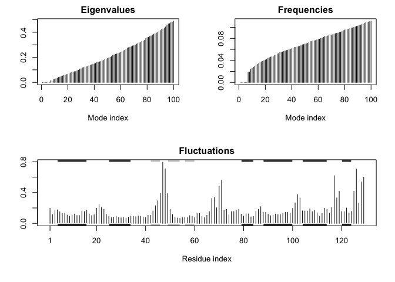

Structural Bioinformatics II
================

Obtain and prepare our structure for "docking"
----------------------------------------------

Here we download the HIV-Ps structure from the PDB database and extract out the protein and ligand portions to separate new PDB format files.

``` r
library(bio3d)
file <- get.pdb("1hsg")
```

    ## Warning in get.pdb("1hsg"): ./1hsg.pdb exists. Skipping download

``` r
hiv <- read.pdb(file)
hiv
```

    ## 
    ##  Call:  read.pdb(file = file)
    ## 
    ##    Total Models#: 1
    ##      Total Atoms#: 1686,  XYZs#: 5058  Chains#: 2  (values: A B)
    ## 
    ##      Protein Atoms#: 1514  (residues/Calpha atoms#: 198)
    ##      Nucleic acid Atoms#: 0  (residues/phosphate atoms#: 0)
    ## 
    ##      Non-protein/nucleic Atoms#: 172  (residues: 128)
    ##      Non-protein/nucleic resid values: [ HOH (127), MK1 (1) ]
    ## 
    ##    Protein sequence:
    ##       PQITLWQRPLVTIKIGGQLKEALLDTGADDTVLEEMSLPGRWKPKMIGGIGGFIKVRQYD
    ##       QILIEICGHKAIGTVLVGPTPVNIIGRNLLTQIGCTLNFPQITLWQRPLVTIKIGGQLKE
    ##       ALLDTGADDTVLEEMSLPGRWKPKMIGGIGGFIKVRQYDQILIEICGHKAIGTVLVGPTP
    ##       VNIIGRNLLTQIGCTLNF
    ## 
    ## + attr: atom, xyz, seqres, helix, sheet,
    ##         calpha, remark, call

``` r
# Select protein only
prot <- atom.select(hiv, "protein", value=TRUE)
prot
```

    ## 
    ##  Call:  trim.pdb(pdb = pdb, sele)
    ## 
    ##    Total Models#: 1
    ##      Total Atoms#: 1514,  XYZs#: 4542  Chains#: 2  (values: A B)
    ## 
    ##      Protein Atoms#: 1514  (residues/Calpha atoms#: 198)
    ##      Nucleic acid Atoms#: 0  (residues/phosphate atoms#: 0)
    ## 
    ##      Non-protein/nucleic Atoms#: 0  (residues: 0)
    ##      Non-protein/nucleic resid values: [ none ]
    ## 
    ##    Protein sequence:
    ##       PQITLWQRPLVTIKIGGQLKEALLDTGADDTVLEEMSLPGRWKPKMIGGIGGFIKVRQYD
    ##       QILIEICGHKAIGTVLVGPTPVNIIGRNLLTQIGCTLNFPQITLWQRPLVTIKIGGQLKE
    ##       ALLDTGADDTVLEEMSLPGRWKPKMIGGIGGFIKVRQYDQILIEICGHKAIGTVLVGPTP
    ##       VNIIGRNLLTQIGCTLNF
    ## 
    ## + attr: atom, helix, sheet, seqres, xyz,
    ##         calpha, call

``` r
write.pdb(prot, file = "1hsg_protein.pdb" )
```

``` r
# Select ligand only
lig <- atom.select(hiv, "ligand", value = TRUE)
lig
```

    ## 
    ##  Call:  trim.pdb(pdb = pdb, sele)
    ## 
    ##    Total Models#: 1
    ##      Total Atoms#: 45,  XYZs#: 135  Chains#: 1  (values: B)
    ## 
    ##      Protein Atoms#: 0  (residues/Calpha atoms#: 0)
    ##      Nucleic acid Atoms#: 0  (residues/phosphate atoms#: 0)
    ## 
    ##      Non-protein/nucleic Atoms#: 45  (residues: 1)
    ##      Non-protein/nucleic resid values: [ MK1 (1) ]
    ## 
    ## + attr: atom, helix, sheet, seqres, xyz,
    ##         calpha, call

``` r
write.pdb(lig, file="1hsg_ligand.pdb")
```

Add Hydrogens and charges in ADT
--------------------------------

We opened our protein only PDB file in AutoDocTools and added hydrogens and atom-types needed for docking calculations

Run docking
-----------

We will use AutoDoc Vina here at the UNIX command line!

``` r
res <- read.pdb("all.pdbqt", multi = TRUE)
res
```

    ## 
    ##  Call:  read.pdb(file = "all.pdbqt", multi = TRUE)
    ## 
    ##    Total Models#: 14
    ##      Total Atoms#: 50,  XYZs#: 2100  Chains#: 1  (values: B)
    ## 
    ##      Protein Atoms#: 0  (residues/Calpha atoms#: 0)
    ##      Nucleic acid Atoms#: 0  (residues/phosphate atoms#: 0)
    ## 
    ##      Non-protein/nucleic Atoms#: 50  (residues: 1)
    ##      Non-protein/nucleic resid values: [ MK1 (1) ]
    ## 
    ## + attr: atom, xyz, calpha, call

``` r
write.pdb(res, "results.pdb")
```

Compare our docking poses to the MERK drug structure

``` r
ori <- read.pdb("ligand.pdbqt")
rmsd(ori, res)
```

    ##  [1]  0.590 11.163 10.531  4.364 11.040  3.682  5.741  3.864  5.442 10.920
    ## [11]  4.318  6.249 11.084  8.929

-   the smaller the value here, the smaller the distance between the tested ligand and the MERK drug

Normal Mode Analysis example
----------------------------

``` r
pdb <- read.pdb("1hel")
```

    ##   Note: Accessing on-line PDB file

``` r
modes <- nma(pdb)
```

    ##  Building Hessian...     Done in 0.018 seconds.
    ##  Diagonalizing Hessian...    Done in 0.094 seconds.

``` r
m7 <- mktrj(modes, mode=7, file="mode_7.pdb")
```

``` r
plot(modes, sse=pdb)
```


