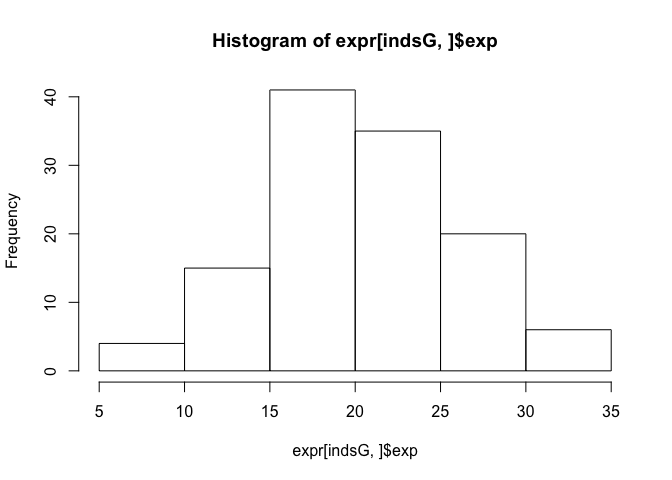
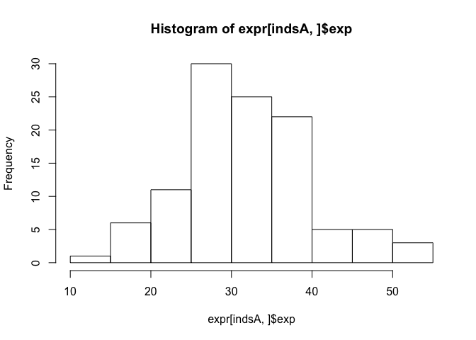
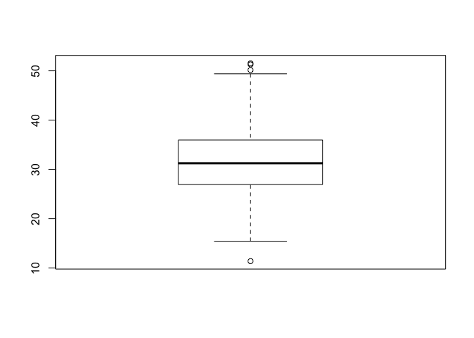
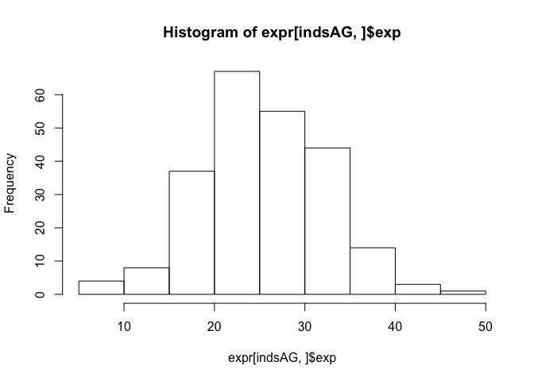
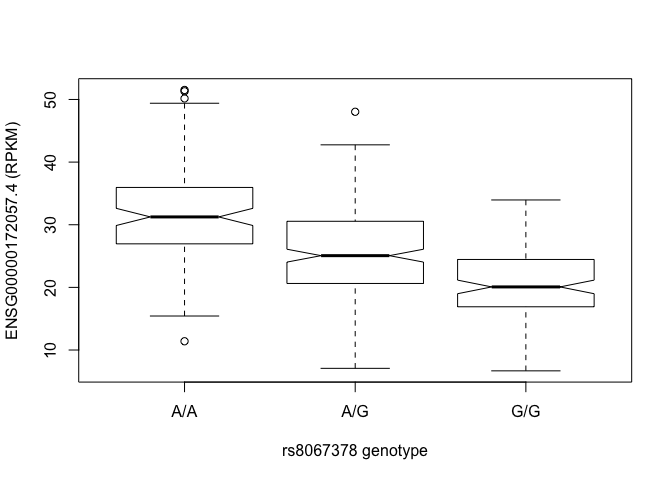
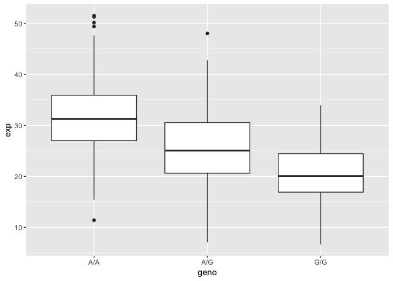
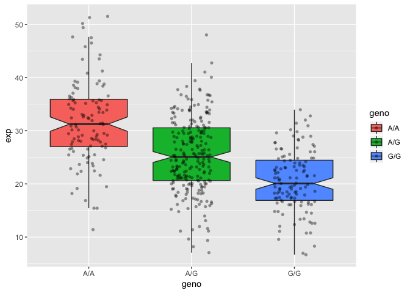

Class 13: Genome Informatics Part I
================

``` r
mxl <- read.csv("373531-SampleGenotypes-Homo_sapiens_Variation_Sample_rs8067378.csv")
head(mxl)
```

    ##   Sample..Male.Female.Unknown. Genotype..forward.strand. Population.s.
    ## 1                  NA19648 (F)                       A|A ALL, AMR, MXL
    ## 2                  NA19649 (M)                       G|G ALL, AMR, MXL
    ## 3                  NA19651 (F)                       A|A ALL, AMR, MXL
    ## 4                  NA19652 (M)                       G|G ALL, AMR, MXL
    ## 5                  NA19654 (F)                       G|G ALL, AMR, MXL
    ## 6                  NA19655 (M)                       A|G ALL, AMR, MXL
    ##   Father Mother
    ## 1      -      -
    ## 2      -      -
    ## 3      -      -
    ## 4      -      -
    ## 5      -      -
    ## 6      -      -

``` r
table(mxl$Genotype..forward.strand.)
```

    ## 
    ## A|A A|G G|A G|G 
    ##  22  21  12   9

``` r
# proportion
table(mxl$Genotype..forward.strand.)/nrow(mxl)
```

    ## 
    ##      A|A      A|G      G|A      G|G 
    ## 0.343750 0.328125 0.187500 0.140625

Quality scores in FASTQ files
-----------------------------

``` r
# help
# library(seqinr)
# library(gtools)
# phred <- asc( s2c("DDDDCDEDCDDDDBBDDDCC@") ) - 33phred
## D D D D C D E D C D D D D B B D D D C C @
## 35 35 35 35 34 35 36 35 34 35 35 35 35 33 33 35 35 35 34 34 31
# prob <- 10**(-phred/10)
```

Section 4: Population Scale Analysis
------------------------------------

``` r
expr <- read.table("rs8067378_ENSG00000172057.6.txt")
summary(expr)
```

    ##      sample     geno          exp        
    ##  HG00096:  1   A/A:108   Min.   : 6.675  
    ##  HG00097:  1   A/G:233   1st Qu.:20.004  
    ##  HG00099:  1   G/G:121   Median :25.116  
    ##  HG00100:  1             Mean   :25.640  
    ##  HG00101:  1             3rd Qu.:30.779  
    ##  HG00102:  1             Max.   :51.518  
    ##  (Other):456

Break it down and access rows that contain each genotype
========================================================

``` r
indsG <- (expr$geno == "G/G")
summary(expr[indsG,]$exp)
```

    ##    Min. 1st Qu.  Median    Mean 3rd Qu.    Max. 
    ##   6.675  16.903  20.074  20.594  24.457  33.956

``` r
hist(expr[indsG,]$exp)
```



``` r
indsA <- (expr$geno == "A/A")
summary(expr[indsA,]$exp)
```

    ##    Min. 1st Qu.  Median    Mean 3rd Qu.    Max. 
    ##   11.40   27.02   31.25   31.82   35.92   51.52

``` r
hist(expr[indsA,]$exp)
```



``` r
boxplot(expr[indsA,]$exp)
```



``` r
indsAG <- (expr$geno == "A/G")
summary(expr[indsAG,]$exp)
```

    ##    Min. 1st Qu.  Median    Mean 3rd Qu.    Max. 
    ##   7.075  20.626  25.065  25.397  30.552  48.034

``` r
hist(expr[indsAG,]$exp)
```



First try at a boxplot to show this data

``` r
# y ~ grp
boxplot(exp ~ geno, data = expr, notch=TRUE, xlab="rs8067378 genotype", ylab="ENSG00000172057.4 (RPKM)")
```



``` r
library(ggplot2)
```

    ## Warning: package 'ggplot2' was built under R version 3.5.2

``` r
## Boxplot
ggplot(expr, aes(geno, exp)) + geom_boxplot()
```



``` r
## Histogram of the exp column with ggplot2
ggplot(expr, aes(exp, fill = geno)) + geom_density(alpha = 0.2)
```


``` r
# Boxplot with the data shown
ggplot(expr, aes(geno, exp, fill=geno)) + 
  geom_boxplot(notch=TRUE, outlier.shape = NA) + 
  geom_jitter(shape=16, position=position_jitter(0.2), alpha=0.4)
```


