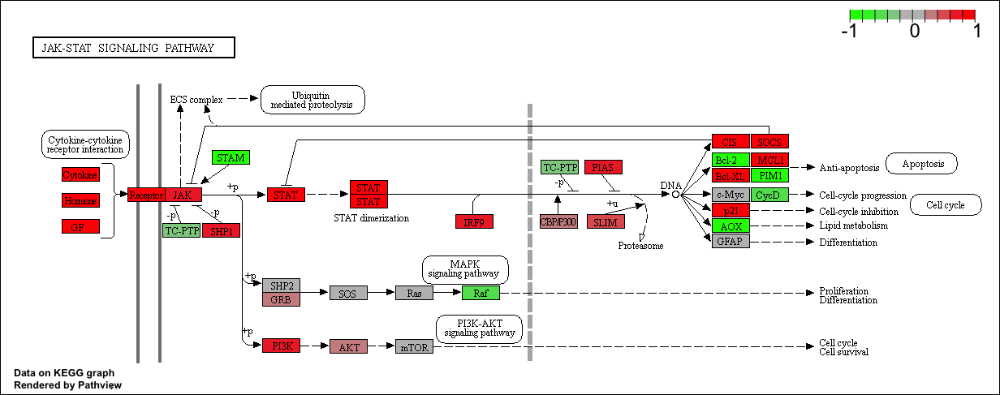

```{r setup, include=FALSE}
knitr::opts_chunk$set(echo = TRUE)
```

## Differential Expression Analysis

Load our input countData and metadata
```{r}
countdata <- read.csv("GSE37704_featurecounts.csv", row.names = 1)
colData <- read.csv("GSE37704_metadata.csv", row.names = 1)
```
We will use the DESeq2 package from bioconductor
```{r}
library(DESeq2)
```

#Import metadata and take a peak
```{r}
head(colData)
```

#Import countData and take a peak
```{r}
head(countdata)
```


# Note we need to remove the odd first $length col
```{r}
countData <- as.matrix(countdata[,-1])
head(countData)
```

# Filter count data where you have 0 read count across all samples

```{r}
nonzero.inds <- (rowSums(countData) != 0)
countData <- countData[nonzero.inds, ]
head(countData)
```

# Running DESeq2 

```{r}
dds <- DESeqDataSetFromMatrix(countData = countData, colData = colData, design = ~condition)
dds = DESeq(dds)
```


```{r}
res <- results(dds)
head(res)
```

```{r}
summary(res)
```


Make a Volcano Plot to show the results. Basically, this is a plot of log2 fold change vs. -log adjusted p-value
```{r}
plot(res$log2FoldChange, -log(res$padj))
```

Improve the plot!

# Make a color vector for all genes

```{r}
mycols <- rep("gray", nrow(res))
```


# Color the genes with absolute fold change above 2 red

```{r}
mycols[abs(res$log2FoldChange) > 2 ]  <- "red"
```

# Color those with adjusted p-value less than 0.01 and absolute fold change more than 2 blue

```{r}
inds <- (abs(res$log2FoldChange) > 2) & (res$padj) < 0.01
mycols[inds] <- "blue"
```


```{r}
plot(res$log2FoldChange, -log(res$padj), col= mycols, xlab="Log2(Fold Change)", ylab="-Log(P-value)")
```

## Adding gene annotation

```{r}
library("AnnotationDbi")
library("org.Hs.eg.db")
columns(org.Hs.eg.db)
```

```{r}
res$symbol = mapIds(org.Hs.eg.db, 
                    keys=row.names(res),     ##Our existed IDs
                    keytype="ENSEMBL",       ## Format of our IDs
                    column = "SYMBOL" ,      ## The format we want!
                    multiVals = "first")     ## What to do if there are multiple variables
```


```{r}
res$symbol = mapIds(org.Hs.eg.db, keys=row.names(res), keytype="ENSEMBL", column = "SYMBOL" , multiVals = "first")
res$entrez = mapIds(org.Hs.eg.db, keys= row.names(res), keytype="ENSEMBL", column="ENTREZID", multiVals = "first")
res$name = mapIds(org.Hs.eg.db, keys = row.names(res) , keytype="ENSEMBL", column="GENENAME", multiVals = "first")
head(res,10)
```


## Section 2: Pathway Analysis

```{r}
library(pathview)
library(gage)
library(gageData)
```

```{r}
data("kegg.sets.hs")
data("sigmet.idx.hs")
```

```{r}
# Focus on signaling and metabolic pathways only
kegg.sets.hs = kegg.sets.hs[sigmet.idx.hs]
# Examine the first 3 pathways 
head(kegg.sets.hs, 3)
```

the **gage** package wants a vector as input with our numeric scores of interest with the vector names being ENTREZ IDs
```{r}
foldchanges = res$log2FoldChange
names(foldchanges) = res$entrez
head(foldchanges)
```

#Get the results
```{r}
keggres <- gage(foldchanges, gsets=kegg.sets.hs)
```

```{r}
attributes(keggres)
```


```{r}
head(keggres$less)
```

```{r}
pathview(gene.data=foldchanges, pathway.id="hsa04110")
```


```{r}
# A different PDF based output of the same data
pathview(gene.data=foldchanges, pathway.id = "hsa04110", kegg.native = FALSE)
```


## Focus on the top 5 upregulated pathways here for demo purposes only
```{r}
keggrespathways <- rownames(keggres$greater)[1:5]

#Extract the 8 character long IDs part of each string
keggresids = substr(keggrespathways, start=1, stop=8)
keggresids
```
Let's pass these IDs in keggresids to the *pathview()* fnction to draw plots for all the top 5 pathways. 
```{r}
pathview(gene.data=foldchanges, pathway.id = keggresids, species = "hsa")
```

Can you do the same procedure as above to plot the pathview figures for the top 5 downregulated pathways? 





## Section 3: Gene Ontology (GO)

Again we will se **gage()** but this time with GO genesets rather than KEGG

```{r}
data(go.sets.hs)
data(go.subs.hs)

# Focus on Biological Process subset of GO
gobpsets = go.sets.hs[go.subs.hs$BP]

gobpres = gage(foldchanges, gsets=gobpsets, same.dir=TRUE)

lapply(gobpres, head)
```


## Section 4: Reactome Analysis

```{r}
sig_genes <- res[res$padj <= 0.05 & !is.na(res$padj), "symbol"]
print(paste("Total number of significant genes:", length(sig_genes)))
```

```{r}
write.table(sig_genes, file="significant_genes.txt", row.names=FALSE, col.names=FALSE, quote=FALSE)
```


