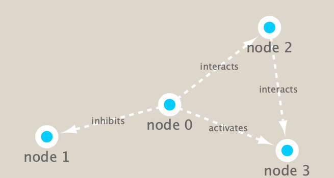

```{r setup, include=FALSE}
knitr::opts_chunk$set(echo = TRUE)
```

Load the required packages **RCy3** from bioconductor and **igraph** from CRAN.
```{r}
#library(RCy3)
#library(igraph)
#library(RColorBrewer)
```


# Test the connection to Cytoscape.
```{r}
cytoscapePing()
```

# Check the version
```{r}
cytoscapeVersionInfo()
```

We can test things further by making a small network (here in igraph format as used by the R **igraph** package) and sending it to Cytoscape
```{r}
g <- makeSimpleIgraph()
createNetworkFromIgraph(g, "myGraph")
```


```{r}
fig <- exportImage(filename = "demo", type="png", height = 350)
```


```{r}
knitr::include_graphics("./demo.png")
```


```{r}
setVisualStyle("Marquee")
```


```{r}
fig2 <- exportImage(filename = "demo_marquee", type = "png", height = 350)

```


```{r}
styles <- getVisualStyleNames()
styles
```


```{r}
#setVisualStyle(styles[13])
setVisualStyle(styles[18])
```

```{r}
plot(g)
```


```{r}
prok_vir_cor <- read.delim("virus_prok_cor_abundant.tsv", stringsAsFactors = FALSE)
head(prok_vir_cor)
```

How many edges will we have?
```{r}
#
```


How many unique species are there?
```{r}
length(unique(c(prok_vir_cor[,1],(prok_vir_cor[,2]))))
```


```{r}
g <- graph.data.frame(prok_vir_cor, directed = FALSE)
```

```{r}
class(g)
```

```{r}
g
```

Our current graph is a little too dense in terms of node labels etc. to have a useful 'default' plot figure. But we can have a look anyway.
```{r}
plot(g)
```

This is a hot mess! Let's turn off the blue text labels
```{r}
plot(g, vertex.label = NA)
```

The nodes/vertex ar too big. Let's make them smaller.

```{r}
plot(g, vertex.size=3, vertex.label=NA)
```


```{r}
library(ggraph)
```

```{r}
ggraph(g, layout='auto') + geom_edge_link(alpha=0.25) + geom_node_point(color="steelblue") + theme_graph()
```


To send this network to Cytoscape we can use the command:
```{r}
createNetworkFromIgraph(g, "myIgraph")
```

```{r}
V(g)
```

```{r}
E(g)
```


## Let's calculate some things :) 

Community detection with the Girvin Newman: 

```{r}
 cb <- cluster_edge_betweenness(g)
```

```{r}
plot(cb, y=g, vertex.label=NA, vertex.size=3)
```

You can extract a cluster/community membership vector for further inspection with the membership() function:

```{r}
head(membership(cb))
```


# Node Degree


Calculate and plot node degree of our network
```{r}
d <- degree(g)
hist(d, breaks=30, col = "lightblue", main = "Node Degree Distribution")
```


```{r}
plot(degree_distribution(g), type = "h")
```


# Centrality Analysis

```{r}
pr <- page_rank(g)
head(pr$vector)
```

Let's plot our network with nodes size scaled via these page rank centrality scores.
Make a size vector between 2 and 20 for node plotting size

```{r}
library("BBmisc")
```


```{r}
v.size <- BBmisc::normalize(pr$vector, range=c(2,20), method="range")
plot(g, vertex.size=v.size, vertex.label=NA)
```

```{r}
v.size <- BBmisc::normalize(d, range=c(2,20), method="range")
plot(g, vertex.size=v.size, vertex.label=NA)
```


```{r}
b <- betweenness(g)
v.size <- BBmisc::normalize(b, range=c(2,20), method="range")
plot(g, vertex.size=v.size, vertex.label=NA)
```


# Read taxonomic classification for netowrk annotation

```{r}
phage_id_affiliation <- read.delim("phage_ids_with_affiliation.tsv")
head(phage_id_affiliation)
```

```{r}
bac_id_affi <- read.delim("prok_tax_from_silva.tsv", stringsAsFactors = FALSE)
head(bac_id_affi)
```


Add taxonomic annotation data to netowork

```{r}
## Extract out our vertex names
genenet.nodes <- as.data.frame(vertex.attributes(g), stringsAsFactors=FALSE)
head(genenet.nodes)
```


How many phage (ie. ph_) entries do we have?

```{r}
length(grep("^ph", genenet.nodes[,1]))
```
 

```{r}
845-764
```

Therefore, we have 81 non-phage nodes.


Now let's **merge()** these with the annotation data

```{r}
# We don't need all annotation data so let's make a reduced table 'z' for merging
z <- bac_id_affi[,c("Accession_ID", "Kingdom", "Phylum", "Class")]
n <- merge(genenet.nodes, z, by.x="name", by.y = "Accession_ID", all.x=TRUE)
head(n)
```


```{r}
# Check on the column names before deciding what to merge
colnames(n)
```


```{r}
colnames(phage_id_affiliation)
```

```{r}
# Again we only need a subset of `phage_id_affiliation` for our purposes
y <- phage_id_affiliation[, c("first_sheet.Phage_id_network", "phage_affiliation","Tax_order", "Tax_subfamily")]

# Add the little phage annotation that we have
x <- merge(x=n, y=y, by.x="name", by.y="first_sheet.Phage_id_network", all.x=TRUE)

## Remove duplicates from multiple matches
x <- x[!duplicated( (x$name) ),]
head(x)

```


Save our merged annotation results back to genenet.nodes
```{r}
genenet.nodes <- x
```


# Send netowrk to Cytoscape using RCy3

```{r}
# Open a new connection and delete anhy existing windows/networks in Cy
deleteAllNetworks()
```

```{r}
# Set the main nodes colname to the required "id" 
colnames(genenet.nodes)[1] <- "id"
```

```{r}
genenet.edges <- data.frame(igraph::as_edgelist(g))

# Set the main edges colname to the required "source" and "target" 
colnames(genenet.edges) <- c("source","target")

# Add the weight from igraph to a new column...
genenet.edges$Weight <- igraph::edge_attr(g)$weight

# Send as a new network to Cytoscape
createNetworkFromDataFrames(genenet.nodes,genenet.edges, 
                            title="Tara_Oceans")
```


