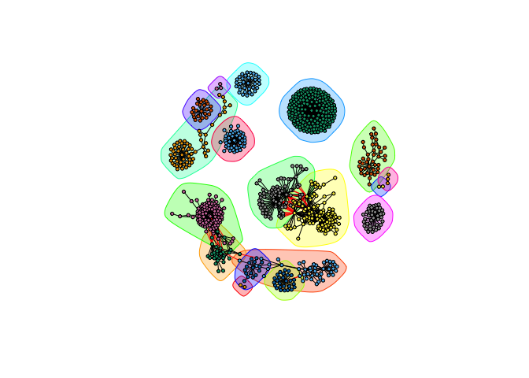

Class 17: Megagenomics Co-occurence Networks
================

Load the required packages **RCy3** from bioconductor and **igraph** from CRAN.

``` r
library(RCy3)
```

    ## Warning: package 'RCy3' was built under R version 3.5.2

``` r
library(igraph)
```

    ## Warning: package 'igraph' was built under R version 3.5.2

    ## 
    ## Attaching package: 'igraph'

    ## The following objects are masked from 'package:stats':
    ## 
    ##     decompose, spectrum

    ## The following object is masked from 'package:base':
    ## 
    ##     union

``` r
library(RColorBrewer)
```

Test the connection to Cytoscape.
=================================

``` r
cytoscapePing()
```

    ## [1] "You are connected to Cytoscape!"

Check the version
=================

``` r
cytoscapeVersionInfo()
```

    ##       apiVersion cytoscapeVersion 
    ##             "v1"          "3.7.1"

We can test things further by making a small network (here in igraph format as used by the R **igraph** package) and sending it to Cytoscape

``` r
g <- makeSimpleIgraph()
createNetworkFromIgraph(g, "myGraph")
```

    ## Loading data...
    ## Applying default style...
    ## Applying preferred layout...

    ## networkSUID 
    ##          52

``` r
fig <- exportImage(filename = "demo", type="png", height = 350)
```

``` r
knitr::include_graphics("./demo.png")
```


``` r
setVisualStyle("Marquee")
```

    ##                 message 
    ## "Visual Style applied."

``` r
fig2 <- exportImage(filename = "demo_marquee", type = "png", height = 350)
knitr::include_graphics("./demo_marquee.png")
```


``` r
styles <- getVisualStyleNames()
styles
```

    ##  [1] "Ripple"               "Sample3"              "BioPAX_SIF"          
    ##  [4] "Solid"                "Directed"             "Gradient1"           
    ##  [7] "Sample1"              "default"              "size_rank"           
    ## [10] "BioPAX"               "Minimal"              "Sample2"             
    ## [13] "Nested Network Style" "Marquee"              "Universe"            
    ## [16] "Curved"               "Big Labels"           "default black"

``` r
#setVisualStyle(styles[13])
setVisualStyle(styles[18])
```

    ##                 message 
    ## "Visual Style applied."

``` r
plot(g)
```


``` r
prok_vir_cor <- read.delim("virus_prok_cor_abundant.tsv", stringsAsFactors = FALSE)
head(prok_vir_cor)
```

    ##       Var1          Var2    weight
    ## 1  ph_1061 AACY020068177 0.8555342
    ## 2  ph_1258 AACY020207233 0.8055750
    ## 3  ph_3164 AACY020207233 0.8122517
    ## 4  ph_1033 AACY020255495 0.8487498
    ## 5 ph_10996 AACY020255495 0.8734617
    ## 6 ph_11038 AACY020255495 0.8740782

How many edges will we have?

``` r
#
```

How many unique species are there?

``` r
length(unique(c(prok_vir_cor[,1],(prok_vir_cor[,2]))))
```

    ## [1] 845

``` r
g <- graph.data.frame(prok_vir_cor, directed = FALSE)
```

``` r
class(g)
```

    ## [1] "igraph"

``` r
g
```

    ## IGRAPH 201662b UNW- 845 1544 -- 
    ## + attr: name (v/c), weight (e/n)
    ## + edges from 201662b (vertex names):
    ##  [1] ph_1061 --AACY020068177 ph_1258 --AACY020207233
    ##  [3] ph_3164 --AACY020207233 ph_1033 --AACY020255495
    ##  [5] ph_10996--AACY020255495 ph_11038--AACY020255495
    ##  [7] ph_11040--AACY020255495 ph_11048--AACY020255495
    ##  [9] ph_11096--AACY020255495 ph_1113 --AACY020255495
    ## [11] ph_1208 --AACY020255495 ph_13207--AACY020255495
    ## [13] ph_1346 --AACY020255495 ph_14679--AACY020255495
    ## [15] ph_1572 --AACY020255495 ph_16045--AACY020255495
    ## + ... omitted several edges

Our current graph is a little too dense in terms of node labels etc. to have a useful 'default' plot figure. But we can have a look anyway.

``` r
plot(g)
```


This is a hot mess! Let's turn off the blue text labels

``` r
plot(g, vertex.label = NA)
```


The nodes/vertex ar too big. Let's make them smaller.

``` r
plot(g, vertex.size=3, vertex.label=NA)
```


``` r
library(ggraph)
```

    ## Loading required package: ggplot2

    ## Warning: package 'ggplot2' was built under R version 3.5.2

``` r
ggraph(g, layout='auto') + geom_edge_link(alpha=0.25) + geom_node_point(color="steelblue") + theme_graph()
```

    ## Using `nicely` as default layout


To send this network to Cytoscape we can use the command:

``` r
createNetworkFromIgraph(g, "myIgraph")
```

    ## Loading data...
    ## Applying default style...
    ## Applying preferred layout...

    ## networkSUID 
    ##          80

``` r
V(g)
```

    ## + 845/845 vertices, named, from 201662b:
    ##   [1] ph_1061       ph_1258       ph_3164       ph_1033       ph_10996     
    ##   [6] ph_11038      ph_11040      ph_11048      ph_11096      ph_1113      
    ##  [11] ph_1208       ph_13207      ph_1346       ph_14679      ph_1572      
    ##  [16] ph_16045      ph_1909       ph_1918       ph_19894      ph_2117      
    ##  [21] ph_2231       ph_2363       ph_276        ph_2775       ph_2798      
    ##  [26] ph_3217       ph_3336       ph_3493       ph_3541       ph_3892      
    ##  [31] ph_4194       ph_4602       ph_4678       ph_484        ph_4993      
    ##  [36] ph_4999       ph_5001       ph_5010       ph_5286       ph_5287      
    ##  [41] ph_5302       ph_5321       ph_5643       ph_6441       ph_654       
    ##  [46] ph_6954       ph_7389       ph_7920       ph_8039       ph_8695      
    ## + ... omitted several vertices

``` r
E(g)
```

    ## + 1544/1544 edges from 201662b (vertex names):
    ##  [1] ph_1061 --AACY020068177 ph_1258 --AACY020207233
    ##  [3] ph_3164 --AACY020207233 ph_1033 --AACY020255495
    ##  [5] ph_10996--AACY020255495 ph_11038--AACY020255495
    ##  [7] ph_11040--AACY020255495 ph_11048--AACY020255495
    ##  [9] ph_11096--AACY020255495 ph_1113 --AACY020255495
    ## [11] ph_1208 --AACY020255495 ph_13207--AACY020255495
    ## [13] ph_1346 --AACY020255495 ph_14679--AACY020255495
    ## [15] ph_1572 --AACY020255495 ph_16045--AACY020255495
    ## [17] ph_1909 --AACY020255495 ph_1918 --AACY020255495
    ## [19] ph_19894--AACY020255495 ph_2117 --AACY020255495
    ## + ... omitted several edges

Let's calculate some things :)
------------------------------

Community detection with the Girvin Newman:

``` r
 cb <- cluster_edge_betweenness(g)
```

    ## Warning in cluster_edge_betweenness(g): At community.c:460 :Membership
    ## vector will be selected based on the lowest modularity score.

    ## Warning in cluster_edge_betweenness(g): At community.c:467 :Modularity
    ## calculation with weighted edge betweenness community detection might not
    ## make sense -- modularity treats edge weights as similarities while edge
    ## betwenness treats them as distances

``` r
plot(cb, y=g, vertex.label=NA, vertex.size=3)
```



You can extract a cluster/community membership vector for further inspection with the membership() function:

``` r
head(membership(cb))
```

    ##  ph_1061  ph_1258  ph_3164  ph_1033 ph_10996 ph_11038 
    ##        1        2        3        4        4        4

Node Degree
===========

Calculate and plot node degree of our network

``` r
d <- degree(g)
hist(d, breaks=30, col = "lightblue", main = "Node Degree Distribution")
```


``` r
plot(degree_distribution(g), type = "h")
```


Centrality Analysis
===================

``` r
pr <- page_rank(g)
head(pr$vector)
```

    ##      ph_1061      ph_1258      ph_3164      ph_1033     ph_10996 
    ## 0.0011834320 0.0011599483 0.0019042088 0.0005788564 0.0005769663 
    ##     ph_11038 
    ## 0.0005745460

Let's plot our network with nodes size scaled via these page rank centrality scores. Make a size vector between 2 and 20 for node plotting size

``` r
library("BBmisc")
```

    ## 
    ## Attaching package: 'BBmisc'

    ## The following object is masked from 'package:igraph':
    ## 
    ##     normalize

    ## The following object is masked from 'package:base':
    ## 
    ##     isFALSE

``` r
v.size <- BBmisc::normalize(pr$vector, range=c(2,20), method="range")
plot(g, vertex.size=v.size, vertex.label=NA)
```


``` r
v.size <- BBmisc::normalize(d, range=c(2,20), method="range")
plot(g, vertex.size=v.size, vertex.label=NA)
```


``` r
b <- betweenness(g)
v.size <- BBmisc::normalize(b, range=c(2,20), method="range")
plot(g, vertex.size=v.size, vertex.label=NA)
```


Read taxonomic classification for netowrk annotation
====================================================

``` r
phage_id_affiliation <- read.delim("phage_ids_with_affiliation.tsv")
head(phage_id_affiliation)
```

    ##   first_sheet.Phage_id first_sheet.Phage_id_network phage_affiliation
    ## 1        109DCM_115804                       ph_775              <NA>
    ## 2        109DCM_115804                       ph_775              <NA>
    ## 3        109DCM_115804                       ph_775              <NA>
    ## 4        109DCM_115804                       ph_775              <NA>
    ## 5        109DCM_115804                       ph_775              <NA>
    ## 6        109DCM_115804                       ph_775              <NA>
    ##   Domain DNA_or_RNA Tax_order Tax_subfamily Tax_family Tax_genus
    ## 1   <NA>       <NA>      <NA>          <NA>       <NA>      <NA>
    ## 2   <NA>       <NA>      <NA>          <NA>       <NA>      <NA>
    ## 3   <NA>       <NA>      <NA>          <NA>       <NA>      <NA>
    ## 4   <NA>       <NA>      <NA>          <NA>       <NA>      <NA>
    ## 5   <NA>       <NA>      <NA>          <NA>       <NA>      <NA>
    ## 6   <NA>       <NA>      <NA>          <NA>       <NA>      <NA>
    ##   Tax_species
    ## 1        <NA>
    ## 2        <NA>
    ## 3        <NA>
    ## 4        <NA>
    ## 5        <NA>
    ## 6        <NA>

``` r
bac_id_affi <- read.delim("prok_tax_from_silva.tsv", stringsAsFactors = FALSE)
head(bac_id_affi)
```

    ##    Accession_ID  Kingdom         Phylum          Class             Order
    ## 1 AACY020068177 Bacteria    Chloroflexi   SAR202 clade marine metagenome
    ## 2 AACY020125842  Archaea  Euryarchaeota Thermoplasmata Thermoplasmatales
    ## 3 AACY020187844  Archaea  Euryarchaeota Thermoplasmata Thermoplasmatales
    ## 4 AACY020105546 Bacteria Actinobacteria Actinobacteria             PeM15
    ## 5 AACY020281370  Archaea  Euryarchaeota Thermoplasmata Thermoplasmatales
    ## 6 AACY020147130  Archaea  Euryarchaeota Thermoplasmata Thermoplasmatales
    ##              Family             Genus Species
    ## 1              <NA>              <NA>    <NA>
    ## 2   Marine Group II marine metagenome    <NA>
    ## 3   Marine Group II marine metagenome    <NA>
    ## 4 marine metagenome              <NA>    <NA>
    ## 5   Marine Group II marine metagenome    <NA>
    ## 6   Marine Group II marine metagenome    <NA>

Add taxonomic annotation data to netowork

``` r
## Extract out our vertex names
genenet.nodes <- as.data.frame(vertex.attributes(g), stringsAsFactors=FALSE)
head(genenet.nodes)
```

    ##       name
    ## 1  ph_1061
    ## 2  ph_1258
    ## 3  ph_3164
    ## 4  ph_1033
    ## 5 ph_10996
    ## 6 ph_11038

How many phage (ie. ph\_) entries do we have?

``` r
length(grep("^ph", genenet.nodes[,1]))
```

    ## [1] 764

``` r
845-764
```

    ## [1] 81

Therefore, we have 81 non-phage nodes.

Now let's **merge()** these with the annotation data

``` r
# We don't need all annotation data so let's make a reduced table 'z' for merging
z <- bac_id_affi[,c("Accession_ID", "Kingdom", "Phylum", "Class")]
n <- merge(genenet.nodes, z, by.x="name", by.y = "Accession_ID", all.x=TRUE)
head(n)
```

    ##            name  Kingdom          Phylum               Class
    ## 1 AACY020068177 Bacteria     Chloroflexi        SAR202 clade
    ## 2 AACY020207233 Bacteria Deferribacteres     Deferribacteres
    ## 3 AACY020255495 Bacteria  Proteobacteria Gammaproteobacteria
    ## 4 AACY020288370 Bacteria  Actinobacteria      Acidimicrobiia
    ## 5 AACY020396101 Bacteria  Actinobacteria      Acidimicrobiia
    ## 6 AACY020398456 Bacteria  Proteobacteria Gammaproteobacteria

``` r
# Check on the column names before deciding what to merge
colnames(n)
```

    ## [1] "name"    "Kingdom" "Phylum"  "Class"

``` r
colnames(phage_id_affiliation)
```

    ##  [1] "first_sheet.Phage_id"         "first_sheet.Phage_id_network"
    ##  [3] "phage_affiliation"            "Domain"                      
    ##  [5] "DNA_or_RNA"                   "Tax_order"                   
    ##  [7] "Tax_subfamily"                "Tax_family"                  
    ##  [9] "Tax_genus"                    "Tax_species"

``` r
# Again we only need a subset of `phage_id_affiliation` for our purposes
y <- phage_id_affiliation[, c("first_sheet.Phage_id_network", "phage_affiliation","Tax_order", "Tax_subfamily")]

# Add the little phage annotation that we have
x <- merge(x=n, y=y, by.x="name", by.y="first_sheet.Phage_id_network", all.x=TRUE)

## Remove duplicates from multiple matches
x <- x[!duplicated( (x$name) ),]
head(x)
```

    ##            name  Kingdom          Phylum               Class
    ## 1 AACY020068177 Bacteria     Chloroflexi        SAR202 clade
    ## 2 AACY020207233 Bacteria Deferribacteres     Deferribacteres
    ## 3 AACY020255495 Bacteria  Proteobacteria Gammaproteobacteria
    ## 4 AACY020288370 Bacteria  Actinobacteria      Acidimicrobiia
    ## 5 AACY020396101 Bacteria  Actinobacteria      Acidimicrobiia
    ## 6 AACY020398456 Bacteria  Proteobacteria Gammaproteobacteria
    ##   phage_affiliation Tax_order Tax_subfamily
    ## 1              <NA>      <NA>          <NA>
    ## 2              <NA>      <NA>          <NA>
    ## 3              <NA>      <NA>          <NA>
    ## 4              <NA>      <NA>          <NA>
    ## 5              <NA>      <NA>          <NA>
    ## 6              <NA>      <NA>          <NA>

Save our merged annotation results back to genenet.nodes

``` r
genenet.nodes <- x
```

Send netowrk to Cytoscape using RCy3
====================================

``` r
# Open a new connection and delete anhy existing windows/networks in Cy
deleteAllNetworks()
```

``` r
# Set the main nodes colname to the required "id" 
colnames(genenet.nodes)[1] <- "id"
```

``` r
genenet.edges <- data.frame(igraph::as_edgelist(g))

# Set the main edges colname to the required "source" and "target" 
colnames(genenet.edges) <- c("source","target")

# Add the weight from igraph to a new column...
genenet.edges$Weight <- igraph::edge_attr(g)$weight

# Send as a new network to Cytoscape
createNetworkFromDataFrames(genenet.nodes,genenet.edges, 
                            title="Tara_Oceans")
```

    ## Loading data...
    ## Applying default style...
    ## Applying preferred layout...

    ## networkSUID 
    ##        4886
